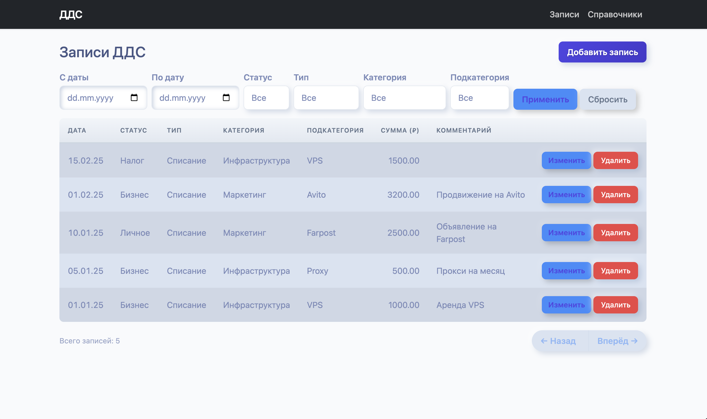
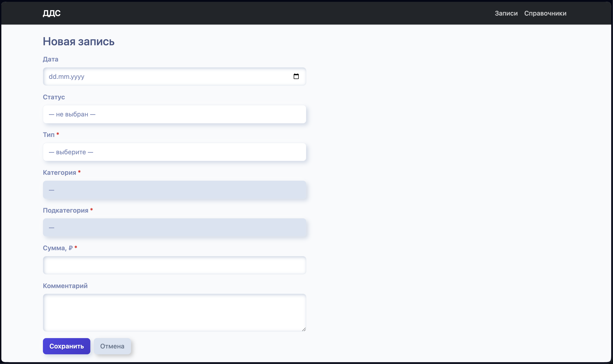
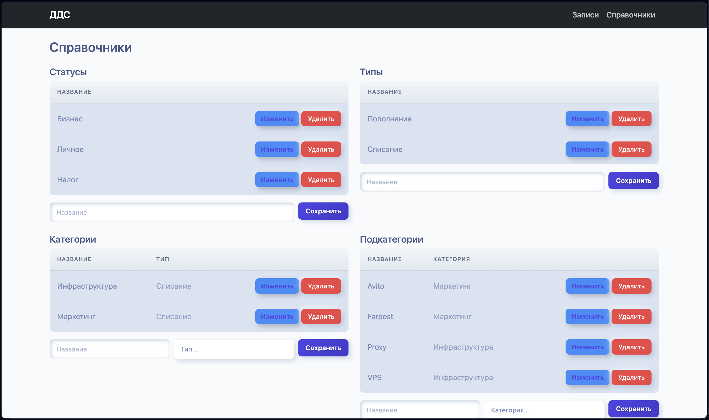

# Cash Flow Service

Веб-сервис для учёта движения денежных средств (ДДС) с REST API и веб-интерфейсом.

## Описание

Сервис позволяет создавать, просматривать, редактировать и удалять записи о денежных операциях с классификацией по статусу, типу, категории и подкатегории. Справочники расширяемы, между ними действует иерархия **Тип → Категория → Подкатегория**.

### Возможности

- **Управление справочниками** — полный CRUD для статусов, типов, категорий и подкатегорий
- **Записи об операциях** — создание, чтение, редактирование и удаление финансовых записей
- **Фильтрация списка** — фильтрация по дате и всем справочникам
- **Валидация иерархии** — контроль соответствия категории типу, подкатегории — категории
- **Защита данных** — запрет удаления справочных записей, используемых в операциях (HTTP 409)
- **Пагинация** — 25 записей на страницу
- **OpenAPI-документация** — Swagger UI и ReDoc

## Интерфейс

### Главная страница — таблица с фильтрами


### Форма создания/редактирования записи


### Управление справочниками


## Установка и запуск

### Локальная разработка

```bash
# Установка зависимостей
uv sync

# Применение миграций
make migrate

# Загрузка демо-данных (опционально)
make seed

# Запуск сервера
uv run cash_flow_service/manage.py runserver
```

Сервис будет доступен по адресу `http://localhost:8000`

### Запуск в Docker

```bash
# Сборка образа
docker build -t cash-flow-service .

# Запуск контейнера
docker run -p 8000:8000 cash-flow-service
```

При запуске контейнера автоматически:
1. Применяются миграции базы данных
2. Загружаются демо-данные
3. Запускается gunicorn на `0.0.0.0:8000`

Сервис будет доступен по адресу `http://localhost:8000`

## Технологический стек

### Backend

- **Python 3.14**
- **Django 6** + Django ORM
- **Django REST Framework** — REST API
- **django-filter** — фильтрация списков
- **drf-spectacular** — OpenAPI-документация
- **gunicorn** — production-сервер
- **SQLite** — база данных

### Frontend

- Django-шаблоны + Bootstrap 5
- Vanilla JavaScript (fetch API)

### DevOps

- **uv** — менеджер зависимостей
- **Docker** — контейнеризация
- **ruff** — форматтер и линтер (79 символов, одинарные кавычки)
- **mypy** + django-stubs — статическая типизация
- **pytest** + pytest-django + pytest-cov — тестирование

## API endpoints

### Документация

- **Swagger UI:** `http://localhost:8000/api/schema/swagger-ui/`
- **ReDoc:** `http://localhost:8000/api/schema/redoc/`
- **OpenAPI schema:** `http://localhost:8000/api/schema/`

### REST API

| Endpoint | Описание |
|----------|----------|
| `GET /api/statuses/` | Список статусов |
| `POST /api/statuses/` | Создать статус |
| `GET /api/statuses/{id}/` | Получить статус |
| `PUT /api/statuses/{id}/` | Обновить статус |
| `DELETE /api/statuses/{id}/` | Удалить статус |
| `GET /api/types/` | Список типов операций |
| `POST /api/types/` | Создать тип |
| `GET /api/types/{id}/` | Получить тип |
| `PUT /api/types/{id}/` | Обновить тип |
| `DELETE /api/types/{id}/` | Удалить тип |
| `GET /api/categories/?type={id}` | Список категорий (с фильтром по типу) |
| `POST /api/categories/` | Создать категорию |
| `GET /api/categories/{id}/` | Получить категорию |
| `PUT /api/categories/{id}/` | Обновить категорию |
| `DELETE /api/categories/{id}/` | Удалить категорию |
| `GET /api/subcategories/?category={id}` | Список подкатегорий (с фильтром по категории) |
| `POST /api/subcategories/` | Создать подкатегорию |
| `GET /api/subcategories/{id}/` | Получить подкатегорию |
| `PUT /api/subcategories/{id}/` | Обновить подкатегорию |
| `DELETE /api/subcategories/{id}/` | Удалить подкатегорию |
| `GET /api/records/` | Список записей с фильтрацией |
| `POST /api/records/` | Создать запись |
| `GET /api/records/{id}/` | Получить запись |
| `PUT /api/records/{id}/` | Обновить запись |
| `DELETE /api/records/{id}/` | Удалить запись |

### Фильтрация записей

`GET /api/records/?date_from=2025-01-01&date_to=2025-12-31&status=1&type=2&category=3&subcategory=4`

- `date_from` — начало периода (ISO формат даты)
- `date_to` — конец периода (ISO формат даты)
- `status` — ID статуса
- `type` — ID типа
- `category` — ID категории
- `subcategory` — ID подкатегории

### Веб-интерфейс

| Route | Описание |
|-------|----------|
| `/` | Главная страница — таблица записей с фильтрами |
| `/records/new` | Форма создания новой записи |
| `/records/{id}/edit` | Форма редактирования записи |
| `/reference` | Управление справочниками |
| `/admin/` | Django Admin |

## Команды Makefile

Все команды запускаются через `uv run` внутри виртуального окружения.

| Команда | Описание |
|---------|----------|
| `make format` | Форматирование кода (ruff) |
| `make lint` | Проверка кода линтером (ruff) |
| `make type-check` | Статическая типизация (mypy) |
| `make validate` | Полная проверка: format → lint → type-check |
| `make test` | Запуск тестов с покрытием (pytest --cov) |
| `make makemigrations MSG="..."` | Создание миграций |
| `make migrate` | Применение миграций |
| `make seed` | Загрузка демо-данных |

## Структура данных

### Иерархия справочников

```
Тип (Type)
  └─ Категория (Category)
       └─ Подкатегория (Subcategory)
```

### Модель CashFlowRecord

| Поле | Тип | Обязательное | Описание |
|------|-----|--------------|----------|
| `id` | Integer | + | Первичный ключ |
| `created_date` | Date | + | Дата операции (по умолчанию — сегодня) |
| `status` | ForeignKey (Status) | - | Статус (может быть пустым) |
| `type` | ForeignKey (Type) | + | Тип операции |
| `category` | ForeignKey (Category) | + | Категория |
| `subcategory` | ForeignKey (Subcategory) | - | Подкатегория |
| `amount` | Decimal | + | Сумма (положительное число) |
| `comment` | String | + | Комментарий |

Все внешние ключи используют `PROTECT` — нельзя удалить справочную запись, если на неё ссылаются операции.
